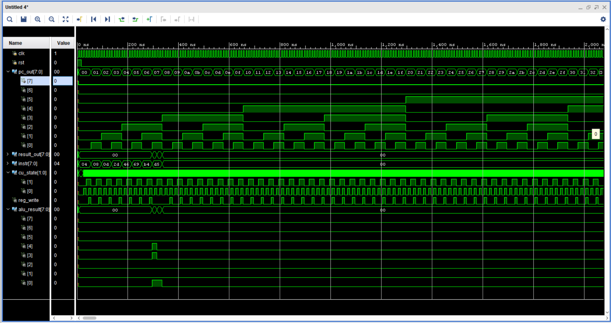

# 8-bit RISC-V Processor in Verilog

A fully functional 8-bit RISC-V-inspired processor implemented in Verilog, 
simulated and synthesised in Xilinx Vivado 2017.4.

## Project Summary

| Item | Detail |
|------|--------|
| Architecture | 4-stage pipeline: IF → ID → EX → WB |
| ISA | Custom 8-bit RISC-V inspired (8 instructions) |
| Registers | 8 × 8-bit general-purpose registers (R0–R7), R0 hardwired to 0 |
| Memory | Separate instruction ROM and data RAM, 256 bytes each |
| Control Unit | FSM-based, 4 states: FETCH, DECODE, EXECUTE, WRITEBACK |
| Target Device | Xilinx Artix-7 xc7a35tcpg236-1 |
| Synthesis Result | 14 LUTs, 8 Flip-Flops |
| Tool | Xilinx Vivado 2017.4 |

## Instruction Set Architecture (ISA)

| Instruction | Opcode | Format | Operation |
|-------------|--------|--------|-----------|
| ADD | 000 | R-type | rd = rs1 + rs2 |
| SUB | 001 | R-type | rd = rs1 - rs2 |
| AND | 010 | R-type | rd = rs1 & rs2 |
| OR  | 011 | R-type | rd = rs1 \| rs2 |
| XOR | 100 | R-type | rd = rs1 ^ rs2 |
| LW  | 101 | I-type | rd = mem[imm] |
| SW  | 110 | I-type | mem[imm] = rs1 |
| BEQ | 111 | B-type | if rs1==rs2: PC = PC + offset |

**Instruction encoding (8 bits):**
- R-type: `[op:3][rd:3][rs1:2]`
- I-type: `[op:3][rd:3][imm:2]`
- B-type: `[op:3][rs1:3][offset:2]`

## Modules

| File | Description |
|------|-------------|
| `alu.v` | 8-bit ALU — ADD, SUB, AND, OR, XOR with zero and carry flags |
| `register_file.v` | 8×8 register file, dual read port, R0 hardwired to 0 |
| `instr_mem.v` | Instruction memory (ROM), 256×8-bit |
| `data_mem.v` | Data memory (RAM), 256×8-bit, synchronous write |
| `control_unit.v` | FSM control unit, 4 states, generates all control signals |
| `if_stage.v` | Instruction Fetch stage with Program Counter |
| `id_stage.v` | Instruction Decode stage |
| `ex_stage.v` | Execute stage, instantiates ALU |
| `wb_stage.v` | Write-Back stage, mux between ALU result and memory data |
| `processor_top.v` | Top-level module connecting all stages |
| `tb_selfcheck.v` | Self-checking testbench — verifies all 8 registers |

## Simulation Results

Self-checking testbench output — all 8 register checks passing:ALL 8 TESTS PASSED
## Waveform

*PC increments every 4 clock cycles (one full pipeline pass). 
FSM cycles FETCH→DECODE→EXECUTE→WRITEBACK. 
Clock: 100 MHz (10ns period).*

## Key Design Decisions

- **RAW hazard resolution** via NOP insertion (pipeline bubbling) — 
  dependent instructions separated by 2 NOP cycles
- **Combinational ALU** with registered writeback for correct pipeline timing
- **Synchronous reset** on all sequential elements
- **R0 hardwired to zero** per RISC-V convention — writes to R0 are ignored

## How to Run

1. Open Xilinx Vivado 2017.4 or later
2. Create new RTL project, add all `.v` files as design sources
3. Add `tb_selfcheck.v` as simulation source
4. Set `tb_selfcheck` as top for simulation
5. Run Behavioral Simulation
6. Check Tcl Console for PASS/FAIL results

## Resume Bullet

> Designed and simulated an 8-bit RISC-V processor in Verilog with a 4-stage 
> pipeline (IF/ID/EX/WB) and FSM-based control unit supporting 8 custom 
> instructions; synthesised on Xilinx Artix-7 (xc7a35tcpg236-1) using 14 LUTs 
> and 8 flip-flops in Vivado 2017.4; verified with a self-checking testbench — 
> all 8 register file checks passing.
